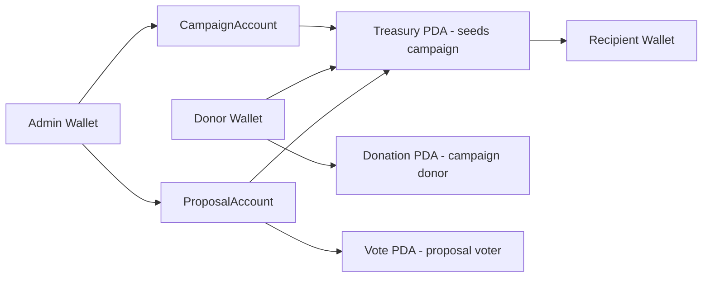

# 🧾 Charity Fund DApp – Hệ thống Quản Lý Quỹ Từ Thiện Minh Bạch trên Solana

## 1. Giới thiệu

Trong bối cảnh chuyển đổi số tại Việt Nam, các hoạt động từ thiện và cứu trợ vẫn tồn tại nhiều vấn đề về **minh bạch dòng tiền**, **niềm tin cộng đồng** và **khả năng kiểm toán**.
Dự án **Charity Fund DApp** được xây dựng nhằm giải quyết các vấn đề này bằng cách ứng dụng **Blockchain Solana** và **Smart Contract (Anchor)**.

Hệ thống đảm bảo:

* Toàn bộ dòng tiền được ghi nhận **on-chain**
* Không cá nhân hay backend nào có thể **tự ý thay đổi ví nhận tiền**
* Việc giải ngân chỉ được thực hiện khi **cộng đồng biểu quyết thông qua**

---

## 2. Mục tiêu hệ thống

Hệ thống được thiết kế để đảm bảo các yêu cầu sau:

* ✅ Ví nhận tiền được **khóa on-chain**
* ✅ Backend **không có quyền thay đổi ví**
* ✅ Chỉ giải ngân khi **vote đạt điều kiện**
* ✅ Toàn bộ dòng tiền **audit được**
* ✅ Muốn đổi người nhận → **phải tạo proposal & vote lại**
* ✅ Off-chain chỉ xác minh danh tính, **on-chain giữ quyền quyết định**

---

## 3. Ý tưởng tổng thể

Thay vì chuyển tiền trực tiếp từ ví cá nhân, hệ thống sử dụng:

* **Treasury PDA** (Program Derived Address) làm ví trung gian giữ SOL
* **Proposal** để đề xuất giải ngân
* **Cơ chế biểu quyết (Vote)** để cộng đồng quyết định

👉 Không ai (kể cả admin) có thể tự ý rút tiền nếu chưa được cộng đồng chấp thuận.

---

## 4. Kiến trúc hệ thống

### 4.1 Tổng quan kiến trúc

```
User Wallet (Donor / Voter)
        |
        v
Frontend (React / Wallet Adapter)
        |
        v
Solana Program (Anchor)
        |
        +--> CampaignAccount
        +--> Treasury PDA (SystemAccount)
        +--> ProposalAccount
        +--> Vote PDA (chống vote trùng)
```

---

### 4.2 Các thành phần chính

#### 🔹 CampaignAccount

* Đại diện cho một chiến dịch từ thiện
* Lưu thông tin:

  * Người tạo chiến dịch
  * Tổng số tiền đã quyên góp
  * Trạng thái chiến dịch

#### 🔹 Treasury PDA

* Là **SystemAccount (không có data)**
* Chỉ dùng để **giữ SOL**
* Được kiểm soát hoàn toàn bởi smart contract
* Không thể chuyển tiền nếu không có chữ ký PDA hợp lệ

#### 🔹 ProposalAccount

* Đại diện cho một đề xuất giải ngân
* Lưu:

  * Ví nhận tiền (recipient)
  * Số tiền đề xuất
  * Số phiếu YES / NO
  * Trạng thái đã thực thi hay chưa

#### 🔹 Vote PDA

* PDA được tạo theo cặp `(proposal, voter)`
* Đảm bảo:

  * ❌ Không thể vote trùng
  * ✅ Mỗi ví chỉ được vote 1 lần cho mỗi proposal

---

## 5. Luồng hoạt động chính

### 5.1 Khởi tạo chiến dịch

1. Người dùng tạo `CampaignAccount`
2. Hệ thống sẵn sàng nhận donation

---

### 5.2 Quyên góp (Donate)

1. Donor gửi SOL vào `Treasury PDA`
2. `CampaignAccount.total_donated` được cập nhật
3. Dòng tiền được ghi nhận on-chain

---

### 5.3 Tạo đề xuất giải ngân

1. Người quản lý tạo `Proposal`
2. Ví nhận tiền được **khóa cố định trong proposal**
3. Không thể chỉnh sửa recipient sau khi tạo

---

### 5.4 Biểu quyết (Vote)

1. Người dùng vote YES / NO
2. Vote được lưu bằng `Vote PDA`
3. Không thể vote trùng

---

### 5.5 Giải ngân (Execute Proposal)

1. Chỉ được thực hiện khi:

   * Đủ số phiếu YES
   * Proposal chưa từng được execute
2. Smart contract chuyển SOL từ:

   * `Treasury PDA` → `Recipient`
3. Toàn bộ giao dịch được ghi nhận on-chain

---

## 6. Bảo mật & Minh bạch

### 🔐 On-chain

* Ví nhận tiền bị khóa bằng smart contract
* Treasury PDA không thể bị chiếm quyền
* Không có private key cho treasury

### 🔎 Audit

* Mọi giao dịch đều truy vết được trên blockchain
* Proposal, vote, transfer đều public

### 🧠 Off-chain

* Backend chỉ dùng để:

  * Xác minh danh tính
  * Hiển thị dữ liệu
* Không có quyền can thiệp vào dòng tiền

---

## 7. Công nghệ sử dụng

| Thành phần     | Công nghệ                      |
| -------------- | ------------------------------ |
| Blockchain     | Solana                         |
| Smart Contract | Anchor (Rust)                  |
| Frontend       | React + Solana Wallet Adapter  |
| Test           | Mocha + Anchor                 |
| Localnet       | Solana Test Validator (Docker) |

---

## 8. Môi trường phát triển

* OS: Windows + WSL2
* Validator: Solana Test Validator chạy trong Docker
* Deploy & test tách riêng để đảm bảo ổn định

---

## 9. Kết luận

Dự án **Charity Fund DApp** minh họa cách blockchain có thể được ứng dụng vào **chuyển đổi số lĩnh vực từ thiện tại Việt Nam**, giúp tăng **minh bạch**, **niềm tin cộng đồng** và **trách nhiệm giải trình**.


## Sơ đồ Account & PDA (Account Architecture)


---

## Danh sách Account chi tiết

### 1. CampaignAccount
**Mục đích:** Lưu thông tin chiến dịch cứu trợ
```text
- admin: Pubkey
- title: String
- target_amount: u64
- total_donated: u64
- is_active: bool
```

---

### 2. Treasury PDA (Ví quỹ)
**Mục đích:** Giữ toàn bộ SOL của chiến dịch
```text
PDA seeds = ["treasury", campaign_pubkey]
Owner = Program
```
- Không có private key
- Chỉ Program mới có quyền chuyển tiền

---

### 3. Donation PDA
**Mục đích:** Ghi nhận từng người donate
```text
PDA seeds = ["donation", campaign_pubkey, donor_pubkey]
- donor: Pubkey
- amount: u64
```

---

### 4. ProposalAccount
**Mục đích:** Đề xuất phân phối tiền
```text
- campaign: Pubkey
- recipient: Pubkey
- amount: u64
- yes_votes: u64
- no_votes: u64
- executed: bool
```

---

### 5. Vote PDA
**Mục đích:** Tránh vote trùng
```text
PDA seeds = ["vote", proposal_pubkey, voter_pubkey]
- voter: Pubkey
- voted: bool
```

---

## Luồng kiểm soát minh bạch (để trình bày)
1. Donor gửi SOL → Treasury PDA
2. Admin tạo Proposal (không rút tiền)
3. Donor vote → tạo Vote PDA
4. Program kiểm tra điều kiện
5. Treasury PDA chuyển SOL cho Recipient

---

## Câu giải thích ngắn cho slide
> "Tiền được giữ trong Treasury PDA do smart contract quản lý.
> Không ai có private key của ví quỹ, vì vậy tiền chỉ có thể được giải ngân khi proposal được cộng đồng thông qua."

>“Hệ thống áp dụng mô hình danh tính hai lớp:
>blockchain đảm bảo bất biến và minh bạch dòng tiền,
>trong khi off-chain xử lý xác thực có kiểm soát để bảo vệ quyền riêng tư.”

❝ Muốn đổi recipient → phải vote lại ❞

Cách làm:

recipientWallet → ví nhận tiền bị khóa on-chain

recipientIdentityHash → hash CCCD / MSSV / tổ chức

Off-chain chỉ xác minh danh tính

On-chain chỉ tin hash

👉 Không ai có thể:

Đổi ví

Đổi danh tính

Giải ngân lén

🎯 CÂU TRẢ LỜI “ĂN ĐIỂM” (GHI VÀO README)

“Proposal lưu đồng thời ví nhận và hash định danh.
Nếu muốn thay đổi người nhận, cần tạo proposal mới và được cộng đồng biểu quyết.”